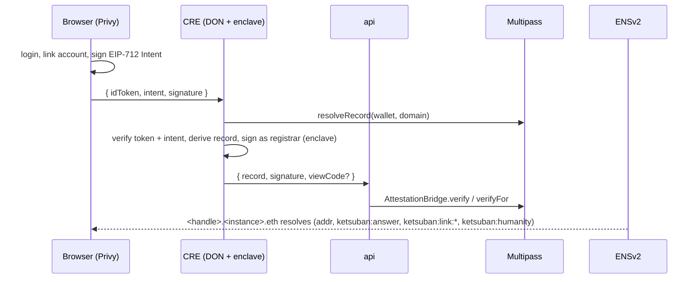

# Ketsuban

Non-deletable, human-verified references. A reference is a Multipass record whose registrar signature is produced
inside a Chainlink CRE enclave from a Privy identity token and a wallet-signed intent; ENSv2 makes every record a
name (`<handle>.<instance>.eth`) that any wallet or agent can resolve without integrating with us.

Any subject can be an instance — a question, a university cohort, an organisation. The subject is a deployment
argument, never a source artifact.

## Packages

| Package | What |
|---|---|
| `packages/registrar` | `@ketsuban/registrar` — pure attester: `(idToken, intent, signature, secrets) → { record, signature, viewCode? }`. Runs unchanged inside the CRE enclave and in the Node fallback. |
| `packages/contracts` | Foundry. `AttestationFactory` deploys one `AttestationRegistry` (ENSv2 `IRegistry` over a Multipass domain) + `AttestationResolver` (ENSIP-10 shim) per instance; `AttestationBridge` proxies registration, grants profile keys, links owned `.eth` names, and lets orgs sponsor. |
| `packages/cre` | Chainlink CRE workflow: HTTP trigger → public checks + chain read on the DON → `handlerInTee` signs as registrar. |
| `apps/api` | Relay: receives enclave output, submits through the bridge, serves the machine-readable verification endpoint. |

## Flow



## Develop

```bash
pnpm install
pnpm -r test                       # registrar (vitest) + contracts (forge)
cd packages/contracts && forge coverage --report summary --no-match-coverage "^(test|vendor|node_modules)/"
```

Sepolia dependencies: Multipass `0x418F82fd0014a4CA402F145978bfaF0555a9cA06`, ENSv2 addresses from
[docs.ens.domains/learn/deployments](https://docs.ens.domains/learn/deployments/).

Environment variables are listed in `.env.example`; never commit `.env`.

## Resolver keys

| Key | Source |
|---|---|
| `addr`, reverse `name` | live Multipass record in the instance domain |
| `text ketsuban:answer`, `text ketsuban:expiry` | record `payload`, `validUntil` |
| `text ketsuban:humanity[:until]` | wallet-keyed hop into the `humanity` domain |
| `data ketsuban:link:<domain>` | wallet-keyed hop → `abi.encodePacked(name, id, payload)`; `payload != 0` ⇒ opted-in, decode with the view code |
| everything else | stock ENSv2 `PermissionedResolver` (user text records, oracle `data` keys, aliases) |

## License

MIT
