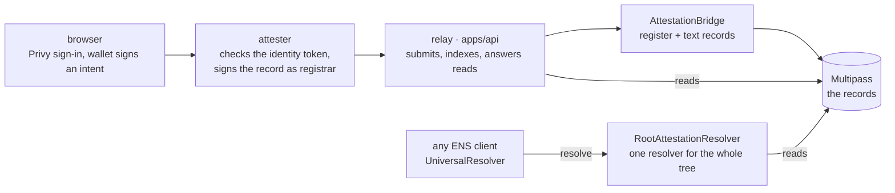

# ShibbolETH

A vouch that cannot be deleted. Somebody who has proved they are one real person vouches for you, and
the vouch becomes an ENS name: `bob.alice.shibboleth.eth` is Bob's vouch for Alice. A reader resolves
it with any wallet, agent or `cast` call, then checks what they find against their own policy — a
minimum number of vouches, proved humanity, linked accounts. Nothing here grades a person; the bar
belongs to whoever is reading.

- Portal: <https://shibboleth.peeramid.xyz>
- API: <https://shibboleth-api.peeramid.xyz>
- Chain: Ethereum Sepolia. Root ENS name `shibboleth.eth`, Multipass root domain `shibboleth`.

Multipass holds the records. ENSv2 gives each one a name, and a single wildcard resolver answers the
whole tree from those records, so there is nothing to integrate with and nothing to keep in step. The
text keys still read `ketsuban:*` — they predate the rename and are live on chain.

One power contradicts the promise: the Multipass owner can call `deleteName`. Where that key is also
the relayer, `GET /v1/preflight` says so rather than leaving it unsaid — see
[docs/architecture.md](docs/architecture.md#trust-boundaries).

## How it fits together



The attester is either this deployment's own node or a Chainlink CRE enclave, where the identity token
never leaves the TEE. The portal says which of the two it is doing.

## Read a name without us

```bash
cast call 0x4A1817d13E9cF196f471725176355C1234b63C70 "resolve(bytes,bytes)(bytes,address)" \
  $(python3 -c "print('0x'+b'\x05alice\x0ashibboleth\x03eth\x00'.hex())") \
  $(cast calldata "text(bytes32,string)" $(cast namehash alice.shibboleth.eth) "ketsuban:answer") \
  --rpc-url sepolia
```

`cast` has no DNS-name encoder, which is why the wire-format name is spelled out. The same call reads
a vouch (`bob.alice.shibboleth.eth`) and an attested account (`alice.com.x.www.shibboleth.eth`).

## Run it locally

```bash
pnpm install
pnpm --filter "./packages/**" run build      # the apps import what the packages generate; needs foundry
cp .env.example .env                         # registrar + Privy values for the local attester
cp apps/web/.env.example apps/web/.env.local # public identifiers only
pnpm --filter @ketsuban/api dev              # http://127.0.0.1:8787
pnpm --filter @ketsuban/web dev              # http://localhost:3000
```

The package build comes first in a fresh checkout and is not an install hook: the container build
installs before it copies any source, so a hook there would have nothing to compile.

`pnpm verify` is the gate — it runs what CI runs, in the same order: lint, typecheck, every package's
tests, and the browser journeys. `pnpm verify:e2e` adds anvil, the contracts deployed from this source
and the API image, driven from outside. Run `pnpm verify`, not `pnpm test`: the unit suites share
fixtures with the code they check, and twice passed a change that broke on push.

## Docs

[docs/README.md](docs/README.md) is the index. The three to start with:

- [docs/architecture.md](docs/architecture.md) — the components, the write path, and who can do what.
- [docs/namespace.md](docs/namespace.md) — what every name under `shibboleth.eth` means.
- [docs/demo.md](docs/demo.md) — the live deployment, checkable with `curl` and `cast`.

## Packages

| Package | What |
|---|---|
| `packages/registrar` | `@ketsuban/registrar` — the pure attester: `(idToken, intent, signature, secrets) → { record, signature, viewCode? }`. The same code runs in the CRE enclave and in the Node fallback. |
| `packages/contracts` | Foundry. `RootAttestationResolver` answers the tree from Multipass; `AttestationBridge` registers records and grants profile keys. |
| `packages/cre` | The Chainlink CRE workflow: HTTP trigger → public checks on the DON → signing inside the enclave. |
| `apps/api` | Relay: submits signed records, indexes them, serves every read the portal and an agent make. |
| `apps/web` | The portal: sign in, attest accounts, claim a name, vouch, read somebody against a policy. |

## Sepolia

| | Address |
|---|---|
| Multipass | `0x418F82fd0014a4CA402F145978bfaF0555a9cA06` |
| `RootAttestationResolver` (serves `shibboleth.eth`) | `0x542012eCb66De81CBd5De2E2952254c0e84a9447` |
| `AttestationBridge` | `0xE5e985B5f152EbD07aF9922d564AA8A7ccB77c62` |
| Stock ENSv2 `PermissionedResolver` | `0x4E2d9783cEFF2ed72CD77C14206b29fe246b24F7` |
| ENSv2 `ETHRegistry` | `0xBDC85dD5b15D7ecb354cd7cb6f2c50b4f2c4F0E2` |
| ENSv2 `UniversalResolver` | `0x4A1817d13E9cF196f471725176355C1234b63C70` |

Every other address is in `packages/contracts/deployments/11155111.json`, which the API image ships
and `GET /v1/preflight` checks against the chain. Names claimed before the rename stay on
`ketsuban.eth` and still resolve; new ones are under `shibboleth.eth`.

Runbook: [docs/deploy.md](docs/deploy.md). Environment variables: `.env.example`. Never commit `.env`.

CI is Forgejo at `git.peeramid.xyz`, which is the `origin` remote.

## License

MIT
