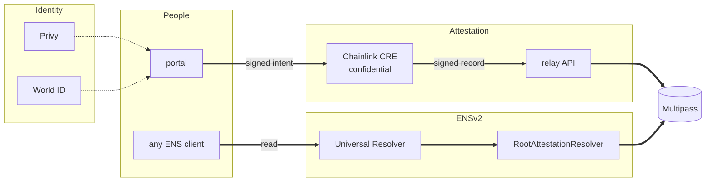

# ShibbolETH

A reference letter that cannot be deleted, and that a reader can check without asking us. Somebody who
has proved they are one real person writes a letter for you; it becomes an ENS name under
`shibboleth.eth`, and whoever is considering you reads it against their own policy.

- Portal: <https://shibboleth.peeramid.xyz>
- API: <https://shibboleth-api.peeramid.xyz>
- Chain: Ethereum Sepolia, root name `shibboleth.eth`

## Key features

- **Non-permissioned.** Anyone writes a letter for anyone; an uninvited one is published and marked `solicited: false`. [architecture.md](docs/architecture.md)
- **Policy driven.** Questions are domains, answers are names; an employer's bar travels in the invite link. [employers.md](docs/employers.md)
- **Sybil protected.** World ID Selfie Check is the floor; a SybilScore over the vouch graph is the rest. [architecture.md](docs/architecture.md#the-selfie-check-one-human-one-account)
- **Privacy and tamper-proof.** The attester is a Chainlink CRE Confidential Workflow: keys live in the enclave, a signed record leaves it. [packages/cre](packages/cre/README.md)
- **View codes.** A private account is a masked name plus a commitment; the holder decides who can open it. [disclosure.md](docs/disclosure.md)
- **Permanent names.** Records are on chain, expiry is enforced at resolution, a withdrawn letter stays readable as withdrawn.

## Stack



**Write:** the person signs an intent, the enclave signs the record as registrar, the relay pays gas
and registers it in Multipass. **Read:** any ENS client asks the Universal Resolver, which reaches
`RootAttestationResolver` through `shibboleth.eth`. Full diagram: [architecture.md](docs/architecture.md#the-stack).

## What it adds to ENSv2

One wildcard resolver answers the whole tree, so a person, a letter, an answer and a platform account
are all paths under `shibboleth.eth` with no per-name registration. Accounts are findable at their own
DNS name (`iampeersky.com.x.www.shibboleth.eth`), and a private one resolves as the holder's label only
until a view code opens it. [namespace.md](docs/namespace.md)

## Run it locally

```bash
pnpm install
pnpm --filter "./packages/**" run build      # needs foundry
cp .env.example .env
cp apps/web/.env.example apps/web/.env.local
pnpm --filter @ketsuban/api dev              # http://127.0.0.1:8787
pnpm --filter @ketsuban/web dev              # http://localhost:3000
pnpm verify                                  # what CI runs
```

## Docs

- [docs/README.md](docs/README.md) — index of everything below
- [architecture.md](docs/architecture.md) — components, write path, trust boundaries
- [namespace.md](docs/namespace.md) — what every name means
- [demo.md](docs/demo.md) — the live deployment, checkable with `curl` and `cast`
- [deploy.md](docs/deploy.md) — runbook; addresses in `packages/contracts/deployments/11155111.json`
- Per package: [api](apps/api/README.md) · [web](apps/web/README.md) · [contracts](packages/contracts/README.md) · [cre](packages/cre/README.md)

## Sepolia

| | Address |
|---|---|
| `RootAttestationResolver` | `0x542012eCb66De81CBd5De2E2952254c0e84a9447` |
| Multipass | `0x418F82fd0014a4CA402F145978bfaF0555a9cA06` |
| `AttestationBridge` | `0xE5e985B5f152EbD07aF9922d564AA8A7ccB77c62` |
| ENSv2 `UniversalResolver` | `0x4A1817d13E9cF196f471725176355C1234b63C70` |

## License

MIT
