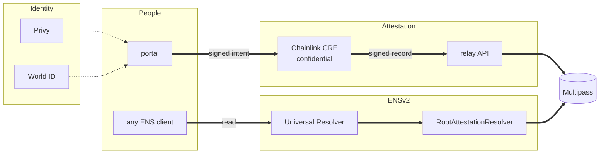

# ShibbolETH

A reference letter that cannot be deleted, and that a reader can check without asking us. Somebody who
has proved they are one real person writes a letter for you; it becomes an ENS name under
`shibboleth.eth`, and whoever is considering you reads it against their own policy.

- Portal: <https://shibboleth.peeramid.xyz>
- API: <https://shibboleth-api.peeramid.xyz>
- Chain: Ethereum Sepolia. Root name `shibboleth.eth`.

## Key features

**Non-permissioned.** Anyone can write a reference letter for anyone, invited or not, and the subject
need not have claimed a name yet. An uninvited letter is published all the same and reported as
`solicited: false`, which a reader may filter on — a note on the letter rather than a barrier to it.
`REQUIRE_INVITE=true` restores the closed behaviour for a deployment that wants it. The letter itself
lives at `POST /v1/letter`; a name holds 31 bytes, so only its `sha256:` hash goes on chain, as the
`description` record the writer signs.

**Policy driven.** An organisation automates three things. *Questions:* a subject is a domain, so
"What do you think of Kim Jong Un?" is `kju-is`, and each answer is a name
(`alice.kju-is.shibboleth.eth`) that a reader resolves directly. *Letter quality:* each statement is
read once by a council and badged critical, neutral or supportive (`GET /v1/readings/:handle`),
unread wherever no council is configured rather than scored by something else. *Sources:* a policy
sets a floor on live vouches, attested accounts and proved humanity, caps how many letters may read as
critical, and can count only the letters the candidate asked for; an invitation can go further and
require the writer to hold an account on named platforms. `/employers` asks one policy of a whole
shortlist, and the bar travels in the link, so a row and the page it links to cannot disagree.

**Sybil protected.** The Selfie Check is the floor, not the answer. `GET /v1/graph/:handle` returns
the neighbourhood — who stands behind somebody, and whether those people stand behind each other —
with a SybilScore from 0 to 100: proved humanity is a floor, every live letter adds a capped share of
its writer's score, and a ring nobody proved sums to nothing. One human holds one account: the World
ID nullifier is bound to a wallet off chain and a second wallet presenting it is refused.

**Privacy and tamper-proof.** The attester is a Chainlink CRE Confidential Workflow: the identity
token, the registrar key and the view-code key exist only inside the enclave, and what leaves is a
signed record anyone can check. Where the enclave is not deployed the same code signs on this
deployment's own node, and the portal says which of the two it is doing rather than claiming the
stronger one.

**View codes.** A private account is stored as a masked name — a one-time pad over the handle — plus a
commitment. It proves the person holds an account on that platform and says nothing about which. A
view code opens it, and the holder decides who gets one: a wallet, a named person, a whole branch
(`*.com.acme.www.shibboleth.eth`), or whoever holds a link whose secret never leaves the fragment.

**Invitations.** A candidate's invitation is signed by the wallet holding their name, so "X asked me
to write this" is X's own claim, and it can open their private accounts to the writer it names — the
invitation code is the secret. An employer's is the same object with `kind: "policy"`, carrying the bar
and landing on `/me?invite=<code>`.

**Permanent names.** Records outlive the service: they are on chain, expiry is enforced at resolution,
and a withdrawn letter stays readable as withdrawn. The one power that contradicts this is the
Multipass owner's `deleteName`, and `GET /v1/preflight` says so when that key is also the relayer.

## Stack



**Write:** the portal has the person sign an intent with their Privy wallet, the enclave verifies
their identity token and signs the record as registrar, the relay pays the gas and registers it in
Multipass with its text keys in one transaction. **Read:** any ENS client asks the Universal Resolver,
which reaches `RootAttestationResolver` through `shibboleth.eth`, which answers from Multipass.
Full diagram with every component: [docs/architecture.md](docs/architecture.md#the-stack).

## What it adds to ENSv2

ShibbolETH is an ENSv2 deployment, not an app behind an API. Three things it extends:

**One wildcard resolver, no per-name registration.** `shibboleth.eth` is the only name registered.
Everything beneath it is answered by a single `RootAttestationResolver` (ENSIP-10), which derives a
name's meaning from its path and reads the record: `<handle>.shibboleth.eth` is a person,
`<writer>.<candidate>.shibboleth.eth` a letter, `<handle>.kju-is.shibboleth.eth` an answer. A path no
record backs answers nothing, so adding a platform or a candidate costs no deployment and no
registration.

**Off-chain account lookup.** A person is findable by an account they hold, because a platform is
mounted at the DNS name it is: `iampeersky.com.x.www.shibboleth.eth` is that X account, resolved from
the record rather than from a name anyone registered. Reverse works too — an address answers with
every name it holds.

**A privacy layer ENS does not have.** The same account kept private resolves under `private-www` as
the *person's* label, which says they hold an account there and nothing more; the handle comes back
only to a reader the holder granted a view code to.

Multipass is the registry underneath: it holds the records, and the registrar's signature on each one
is what makes it a record.

## Read a name without us

```bash
cast call 0x4A1817d13E9cF196f471725176355C1234b63C70 "resolve(bytes,bytes)(bytes,address)" \
  $(python3 -c "print('0x'+b'\x05alice\x0ashibboleth\x03eth\x00'.hex())") \
  $(cast calldata "text(bytes32,string)" $(cast namehash alice.shibboleth.eth) "ketsuban:answer") \
  --rpc-url sepolia
```

`cast` has no DNS-name encoder, which is why the wire-format name is spelled out. The text keys read
`ketsuban:*`: they predate the rename and are live on chain.

## Run it locally

```bash
pnpm install
pnpm --filter "./packages/**" run build      # the apps import what the packages generate; needs foundry
cp .env.example .env                         # registrar + Privy values for the local attester
cp apps/web/.env.example apps/web/.env.local # public identifiers only
pnpm --filter @ketsuban/api dev              # http://127.0.0.1:8787
pnpm --filter @ketsuban/web dev              # http://localhost:3000
```

The package build comes first in a fresh checkout and is not an install hook: the container build
installs before it copies any source, so a hook there would have nothing to compile.

`pnpm verify` is the gate — it runs what CI runs, in the same order: lint, typecheck, every package's
tests, and the browser journeys. `pnpm verify:e2e` adds anvil, the contracts deployed from this source
and the API image, driven from outside. Run `pnpm verify`, not `pnpm test`: the unit suites share
fixtures with the code they check, and twice passed a change that broke on push.

## Docs

[docs/README.md](docs/README.md) is the index. The three to start with:

- [docs/architecture.md](docs/architecture.md) — the components, the write path, and who can do what.
- [docs/namespace.md](docs/namespace.md) — what every name under `shibboleth.eth` means.
- [docs/demo.md](docs/demo.md) — the live deployment, checkable with `curl` and `cast`.

## Packages

| Package | What |
|---|---|
| `packages/registrar` | `@ketsuban/registrar` — the pure attester: `(idToken, intent, signature, secrets) → { record, signature, viewCode? }`. The same code runs in the CRE enclave and in the Node fallback. |
| `packages/contracts` | Foundry. `RootAttestationResolver` answers the tree; `AttestationBridge` registers records and grants profile keys. |
| `packages/cre` | The Chainlink CRE workflow: HTTP trigger → public checks on the DON → signing inside the enclave. |
| `apps/api` | Relay: submits signed records, indexes them, serves every read the portal and an agent make. |
| `apps/web` | The portal: sign in, attest accounts, claim a name, write a letter, read somebody against a policy. |

## Sepolia

| | Address |
|---|---|
| `RootAttestationResolver` (serves `shibboleth.eth`) | `0x542012eCb66De81CBd5De2E2952254c0e84a9447` |
| Multipass | `0x418F82fd0014a4CA402F145978bfaF0555a9cA06` |
| `AttestationBridge` | `0xE5e985B5f152EbD07aF9922d564AA8A7ccB77c62` |
| Stock ENSv2 `PermissionedResolver` | `0x4E2d9783cEFF2ed72CD77C14206b29fe246b24F7` |
| ENSv2 `ETHRegistry` | `0xBDC85dD5b15D7ecb354cd7cb6f2c50b4f2c4F0E2` |
| ENSv2 `UniversalResolver` | `0x4A1817d13E9cF196f471725176355C1234b63C70` |

Every other address is in `packages/contracts/deployments/11155111.json`, which the API image ships
and `GET /v1/preflight` checks against the chain. Names claimed before the rename stay on
`ketsuban.eth` and still resolve; new ones are under `shibboleth.eth`.

Runbook: [docs/deploy.md](docs/deploy.md). Environment variables: `.env.example`. Never commit `.env`.

CI is Forgejo at `git.peeramid.xyz`, which is the `origin` remote.

## License

MIT
