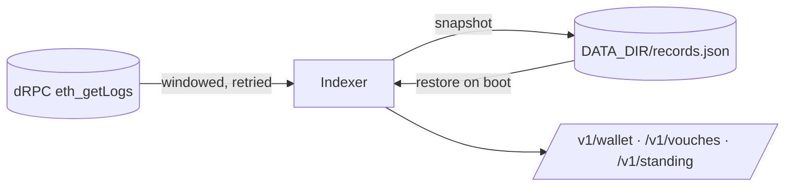

# api

Relay and verification service. One container, env-configured, health-checked on `/healthz`.

| Route | Purpose |
|---|---|
| `POST /v1/cre/delivery` | CRE external delivery: `{ record, signature, viewCode? }` → `AttestationBridge.verify` → `{ ok, txHash }`. Guarded by `x-delivery-token` when `DELIVERY_TOKEN` is set. |
| `POST /v1/attest` | Node registrar fallback (same input/output as the enclave). Enabled only when `REGISTRAR_KEY` and `VIEWCODE_KEY` are set. |
| `GET /v1/verify/:name` | Machine-readable verification read through the ENS resolver: status, wallet, answer, expiry, humanity, links (`?links=x,telegram`, `?viewCode=` to disclose opted-in links), `profile` (the user's `avatar`/`description`/`url`/`email` text records on the stock resolver), evidence, warning. |
| `GET /v1/preflight` | What the configured addresses actually are on chain: code present, which bridge functions the deployed bytecode has, and each name domain's active flag, registrar and fees. 503 with reasons when something is off. |
| `GET /v1/instances` | Instances known to the factory, plus `bridge` and `permissionedResolver` addresses for direct wallet writes. |

CORS: `CORS_ORIGINS` (comma list, default `*`) — set it to the web app origin in production.
| `GET /v1/nonce?wallet=&domain=` | On-chain state for a wallet in a domain; `next` is the nonce to sign into the intent. |
| `GET /v1/name/:domain/:handle` | Is the handle free in that domain; holder wallet and liveness. |
| `POST /v1/submit` | `{record, signature}` → relays a registrar-signed record through the bridge. No secret needed: Multipass accepts it only because the registrar signed it. |
| `POST /v1/provision` | `{handle}` → provisions the candidate's `~<handle>` vouch instance. Idempotent; refuses a handle with no live record in the root name domain, so it needs no secret. |
| `POST /v1/gas` | `{wallet}` → relayer sends `GAS_TOPUP_WEI` once to a wallet holding a live name and below that balance (disabled when 0). |
| `GET /v1/ens/:name` | The name read through the ENSv2 UniversalResolver: the resolver it reached, the address and text records any ENS client would see (`?keys=` overrides). 501 unless `UNIVERSAL_RESOLVER` is set. |
| `GET /v1/standing/:handle` | Live references a handle's wallet gave and it received; `/v1/vouches` carries it per live voucher. |
| `GET /v1/wallet/:address` | A wallet's names, linked-account records and references given (its dashboard). |
| `GET /v1/profile/:handle` | The whole candidate in one read: every instance name with its verification, the references written for them, and the candidate's standing. Facts only; grading against a policy is the reader's job. |
| `GET /v1/vouches/:handle` | Every reference written under the candidate: records in the `~<handle>` vouch domain (Registered/Renewed logs from `DEPLOY_BLOCK`, current state per id, liveness), each live one with the voucher's standing and the long-form `letter` they wrote as a `description` text record. |

A statement in a vouch domain (`~alice`) is refused unless the request carries an invitation signed by
the wallet that holds `alice` in the root name domain (`REQUIRE_INVITE`, on by default). The attest
route reads that wallet on chain, so nothing about the invitation is taken on trust from the browser.

Vouch instances: when a delivery registers a record in the root name domain (`NAME_DOMAINS[0]`), the relay provisions
`~<handle>` — Multipass domain (fee 0, registrar `REGISTRAR_ADDRESS`) → `AttestationFactory.create` → root
`setSubregistry(handle)` — so `bob.alice.<root>` is a real ENS name. Needs `REGISTRY`, `PERMISSIONED_RESOLVER`
(from `DEPLOYMENT_FILE`) and `REGISTRAR_ADDRESS`; the relayer must own Multipass, the factory and the root registry.

## Configuration

See `src/config.ts`. Addresses come from env or from a forge deployment artifact via `DEPLOYMENT_FILE`.

## The index

Record queries never scan the chain on request. `Indexer` tails three Multipass events
(`Registered`, `Renewed`, `nameDeleted`) from `DEPLOY_BLOCK` in windows of `RPC_LOG_WINDOW`, halving
the window whenever the provider refuses a range, and keeps the current state of every record in
memory. `GET /healthz` reports `index: {indexedBlock, head, records, synced}`.



It runs inside this service on purpose: one container, one volume, nothing else to deploy. The
snapshot is rewritten atomically after every tick, so a restart resumes from the last indexed block.
A snapshot older than `DEPLOY_BLOCK` is ignored, which is how a redeploy against new contracts starts
clean.

## What the docker e2e covers

`test/e2e/api.e2e.test.ts` drives a real chain: anvil, the contracts deployed by `DeployLocal.s.sol`,
and this service's image. Besides the API's own routes it exercises the two writes only a browser
makes, because a wrong role grant would otherwise pass every test: the wallet writing its own ENS
profile text record, and `linkOwnName` aliasing a `.eth` name onto a record. It also covers a renewal,
a withdrawal, and a wallet with no role being refused.

## Troubleshooting a deploy

`GET /v1/preflight` answers the first question: is this service pointed at the contracts it thinks it
is. It checks that the bridge, Multipass and the factory have code, that the deployed bridge's
dispatch table contains the functions this build calls, and that every domain the attester may be asked for — name domains and platform domains alike — is
initialised and active with the expected registrar. The same check runs once at boot and prints one line per problem. It exists
because the docker e2e deploys contracts from current source, which cannot catch a live contract that
predates a function this build wants to call.

A missing or malformed variable makes the container exit 1 with one line per problem
(`config error · RELAYER_KEY: missing`), so the deploy log names what to set. Traefik answering
`503 no available server` with its default certificate means no container is running: read the
application log, not the proxy.

## Deploy (Coolify)

`docker-compose.yml` is the production compose: dedicated project `ketsuban-api`, named network `ketsuban_api`, no host
ports (the proxy reaches `expose`d 8787), every setting from the project environment.

## Tests

```bash
pnpm test        # unit, fake chain
pnpm test:e2e    # docker: anvil + DeployLocal.s.sol + api image, full loop from the host
```

The e2e stack is project `ketsuban-e2e` on network `ketsuban_e2e` (`E2E_SUBNET`, default `10.211.7.0/24`) with loopback-only
ports `E2E_ANVIL_PORT` (18545) and `E2E_API_PORT` (18787), so it never collides with other compose projects on the
same machine.
