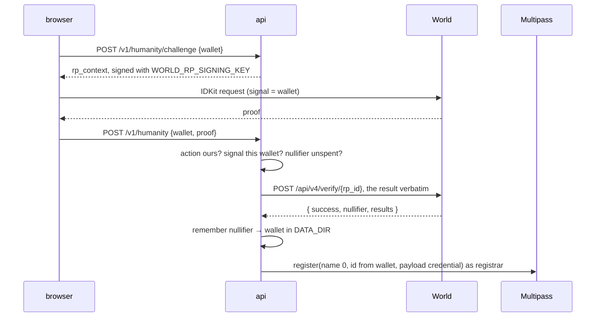
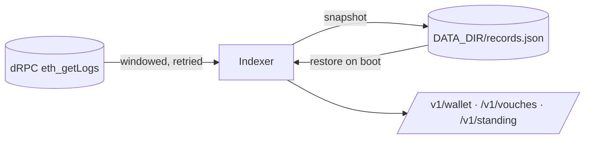
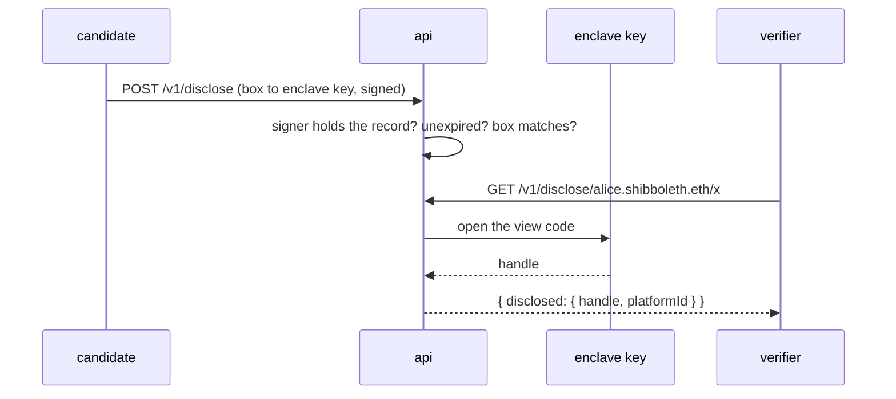

# api

The ShibbolETH relay and verification service: it submits registrar-signed records, indexes them, and
answers every read the portal and an agent make. One container, env-configured, health-checked on
`/healthz`. Live at <https://shibboleth-api.peeramid.xyz>.

| Route                      | Purpose                                                                                                                                                                                                                                                                                                                                                                                                                                                                                                                                                                                                                            |
| -------------------------- | ---------------------------------------------------------------------------------------------------------------------------------------------------------------------------------------------------------------------------------------------------------------------------------------------------------------------------------------------------------------------------------------------------------------------------------------------------------------------------------------------------------------------------------------------------------------------------------------------------------------------------------- |
| `POST /v1/cre/delivery`    | CRE external delivery: `{ record, signature, viewCode? }` → `AttestationBridge.verify` → `{ ok, txHash }`. Guarded by `x-delivery-token` when `DELIVERY_TOKEN` is set.                                                                                                                                                                                                                                                                                                                                                                                                                                                             |
| `POST /v1/attest`          | Node registrar fallback (same input/output as the enclave). Enabled only when `REGISTRAR_KEY` and `VIEWCODE_KEY` are set.                                                                                                                                                                                                                                                                                                                                                                                                                                                                                                          |
| `GET /v1/verify/:name`     | Machine-readable verification read through the ENS resolver: status, wallet, answer, expiry, humanity, links (`?links=` defaults to every mount this deployment holds; an `x-view-code` header discloses opted-in links, and a header rather than a query because that code is permanent and a query string is written into every log on the way), each link's own `ensName`, `profile` (the user's `avatar`/`description`/`url`/`email` text records on the stock resolver), evidence, warning, and `branch` — `private` when the name read is the mirror one, which claims only that the person holds an account in that domain. |
| `GET /v1/preflight`        | What the configured addresses actually are on chain: code present, which bridge functions the deployed bytecode has, and each name domain's active flag, registrar and fees. 503 with reasons when something is off.                                                                                                                                                                                                                                                                                                                                                                                      |
| `GET /v1/instances`        | Every mount this deployment holds, each with `parentName` and — where a private branch exists — `maskedParentName`. Read from the Multipass domains with `ROOT_RESOLVER` set, and from the factories without it. Plus `bridge`, `permissionedResolver`, `ethRegistry`, `ethRegistrar` and `paymentToken` for what a wallet does itself.                                                                                                                                                                                                                                                                                                                                                                    |
| `GET /v1/explain/:name`    | What a name would claim here, whether or not anything resolves at it: `kind` is `person`, `account`, `private`, `reference`, `mount` or `unknown`, so an agent can tell a name nobody holds from one this deployment could never answer — and a mount, one label under the root like `x.<root>`, from the person it is shaped like. Same function the app reads.                                                                                                                                                                                                                                                                   |
| `GET /v1/eth-label/:label` | Who owns a `.eth` label on the registry the bridge checks, so a page can say that before someone pays for a `NotNameOwner` revert. `owner: null` means nobody here holds it.                                                                                                                                                                                                                                                                                                                                                                                                                                                       |

`GET /healthz` also reports `config`: every contract address this process is using, which secrets are set
(never their values), and which optional variables are missing. Addresses need not be configured at all —
the build carries the deployment it was made against, and an explicit variable still wins.

A DNS domain nobody has mounted is provisioned while the first account there is attested: `/v1/attest`
verifies the request first, then initialises the Multipass domain — or, without `ROOT_RESOLVER`, deploys
the grouping levels, the instance and the private mirror — so a person with an ordinary mail host is
never turned away.

CORS: `CORS_ORIGINS` (comma list, default `*`) — set it to the web app origin in production.
| `GET /v1/nonce?wallet=&domain=` | On-chain state for a wallet in a domain; `next` is the nonce to sign into the intent. Also `ready` and `reason`: whether a record in that domain can be written at all (initialised, active, and this attester is its registrar), so the browser learns before the wallet signs. |
| `GET /v1/name/:domain/:handle` | Is the handle free in that domain; holder wallet and liveness. |
| `POST /v1/submit` | `{record, signature}` → relays a registrar-signed record through the bridge. No secret needed: Multipass accepts it only because the registrar signed it. |
| `POST /v1/org` | `{wallet, label}` with `x-org-token` → gives a wallet a record in `ORG_DOMAIN`, which lets it issue references uninvited. Operator-only: the uninvited path is safe only because somebody vouched for the organisation. |
| `POST /v1/provision` | `{handle}` → provisions the candidate's `~<handle>` vouch instance. Idempotent; refuses a handle with no live record in the root name domain, so it needs no secret. |
| `POST /v1/humanity/challenge` | `{wallet}` → the World ID proof request, signed as this app: `app_id`, `action`, `environment`, the `signal` the proof must be bound to (the wallet, lower-cased), and `rp_context`. 501 without `WORLD_APP_ID`, `WORLD_RP_ID` and `WORLD_RP_SIGNING_KEY`. |
| `GET /v1/admin/humanity?wallet=\|handle=` | Demo only, `x-admin-token`: a wallet's humanity state — the record on chain and how many nullifiers are bound to it here. 501 unless `ADMIN_TOKEN` and `REGISTRAR_KEY` are set. |
| `POST /v1/viewcodes` | `{idToken}` (the Privy identity token) → `{codes: {domain: viewCode}}` for every private record the session's wallets hold: derived from the attester's key, the domain and the platform account, never stored, so a person keeps nothing and gets them on any device. 401 on a bad token, 501 without `VIEWCODE_KEY`. |
| `POST /v1/viewcodes/given` | `{idToken, name, viewCode}`: a code somebody gave this person (it arrived on a page as `#viewCode=`), kept against the Privy user so the same page opens on any device. Returned as `given` by `POST /v1/viewcodes`. |
| `GET /v1/admin/selfie-check` | Demo only, `x-admin-token`: whether a reference needs the Selfie Check right now, for everyone (`required`), what was configured, and whether the browser is offered it. |
| `POST /v1/admin/selfie-check` | Demo only, `x-admin-token`: `{required: boolean}` turns the check off for everyone, or back on; persisted in the data dir. |
| `POST /v1/admin/privy/unlink` | Demo only, `x-admin-token` and `PRIVY_APP_SECRET`: `{wallet}` or `{handle}` → finds the Privy user holding the wallet and unlinks every account but the wallets (email, Google, X, GitHub, Discord, LinkedIn…), and deletes the wallet's live platform records on chain (they are keyed by the account, so a fresh wallet attesting the same GitHub would meet `walletMismatch`), so the person can onboard again. Reports what was unlinked, what Privy refused (with its reason; an OAuth account is retried by username when the subject is refused) and what was deleted. |
| `GET /v1/admin/accounts` | Demo only, `x-admin-token`: every wallet this deployment knows (a root name, a humanity record or a nullifier binding), with its handle, whether a live humanity record stands, and how many nullifiers are bound; the rows the admin's controls act on. |
| `POST /v1/admin/humanity/reset-all` | Demo only, `x-admin-token`: forgets every nullifier bound here and deletes every live humanity record on chain, so everybody proves again from nothing (the way out after a migration leaves proofs bound to wallets no name reaches). Reports counts and each delete. |
| `POST /v1/admin/humanity/reset` | Demo only, `x-admin-token`: `{wallet}` or `{handle}` → forgets every nullifier bound to the wallet and deletes its humanity record on chain (a Multipass owner call), so the person can pass the Selfie Check again. Reports what it forgot and whether the delete went through. |
| `POST /v1/humanity` | `{wallet, proof}` → verifies the IDKit result with World, then writes the human into `HUMANITY_DOMAIN` under an id derived from the wallet (Multipass keeps an id for a record's life, and the World nullifier is neither that stable nor something to publish), which is what makes `ketsuban:humanity` answer; the nullifier is remembered off chain so a second wallet cannot claim the same person. 409 when that nullifier already belongs to another account, 422 with World's own reason when the proof is refused. |
| `POST /v1/gas` | `{wallet}` → relayer sends `GAS_TOPUP_WEI` once to a wallet holding a live name and below that balance (disabled when 0). "Once" is kept in `DATA_DIR`, so a redeploy does not hand out a second payout. |
| `GET /v1/ens/:name` | The name read through the ENSv2 UniversalResolver: the resolver it reached, the address and text records any ENS client would see (`?keys=` overrides). 501 unless `UNIVERSAL_RESOLVER` is set. |
| `GET /v1/enclave-key` | The registrar's public key: what a candidate encrypts a view code to, so only the enclave can open it. |
| `POST /v1/disclose` | A candidate's signed permission to read one masked account, carrying the view code encrypted to that key. Refused unless the wallet holding the record signed it, it is unexpired, and the signature binds to that exact ciphertext. |
| `GET /v1/disclose/:name/:domain` | Opens it: the enclave decrypts the view code, decodes the record, and answers the handle. `?reader=` must match a grant addressed to one wallet. |
| `GET /v1/reverse/:address` | Every name an address answers to: its own, each account attested in the open, and each private account named after the holder — `kind` says which. Read from Multipass records through the instance resolvers, so no reverse registry is involved. |
| `GET /v1/standing/:handle` | Live references a handle's wallet gave and it received; `/v1/vouches` carries it per live voucher. |
| `GET /v1/wallet/:address` | A wallet's names, linked-account records, what it wrote about others (`given`: references about people and answers about subjects, `kind` says which), and `org` when it holds a live record in `ORG_DOMAIN` (its dashboard). |
| `GET /v1/profile/:handle` | The whole candidate in one read: every instance name with its verification, the references written for them, and the candidate's standing. Facts only; grading against a policy is the reader's job. |
| `GET /v1/vouches/:handle` | Every reference written under the candidate: records in the `~<handle>` vouch domain (Registered/Renewed logs from `DEPLOY_BLOCK`, current state per id, liveness), each live one with the voucher's standing and the long-form `letter` they wrote as a `description` text record. Live first, newest of each ahead of the older; no voucher is ranked above another, since who is worth believing is the reader's judgement.|
| `GET /v1/graph` | The reference graph: every live reference as an edge from whoever wrote it to whoever it is for, read from every vouch domain, with what each person received and gave. A count is not a shape; this is the shape. |
| `GET /v1/graph/:handle` | One person's neighbourhood: them, everyone either side of them, and every edge among that set — which is where "do their referrers refer each other" is answered. `score` is their SybilScore, 0–100: proved humanity is a floor, every live reference adds a capped share of its writer's score, a ring nobody proved sums to nothing; `rank` is trust per connection (SybilRank). |
| `GET /v1/readings/:handle` | How their references read: each statement written for them and each they wrote, with a provisional polarity (−1 critical … +1 supportive) and rationale from the Noolog fast council (spec §E.8), and one summary per side. Unread wherever no council is configured (`NSED_URL`), never scored by anything else. |
| `GET /v1/find?q=` | Handles that look like what was typed, each with its wallet and standing, ranked by how many people have spoken about them. Two characters minimum. Ten come back; `total` says how many matched, so a reader is never shown a truncated list as though it were the whole of one. |
| `GET /v1/who?handle=&domain=` | Which candidate an account belongs to: the wallet, the handle they claimed and their standing, for a platform account attested in the open. `found: false` when nobody attested it here. |
| `GET /v1/instance/:domain` | What a subject instance is about, from its own records: `name`, `description`, `avatar`, `url`, read through the registry rather than the instance resolver, which answers only for names beneath it. The fifty newest answers; `total` says how many there are, since anybody may answer and the list has no bound.|
| `GET /v1/disclosures/:name` | Every live permission the holder has given: one row per share with its `id`, the domains it opened, the audience it was addressed to and when it expires. What a candidate needs to take one back. |
| `POST /v1/revoke` | `{name, grantId, at, signature}` → takes one grant back, signed by the wallet holding the record. Refused when signed more than five minutes ago, so a captured revocation cannot be replayed against a later share. |
| `POST /v1/letter` | `{text}` → `{hash, ref: "sha256:…", bytes}`. A name holds 31 bytes, so the long-form reference lives here and only its hash goes on chain. 413 over 20kB, 507 when the store is full. Content-addressed: the same letter twice costs nothing. |
| `GET /v1/letter/:hash` | The letter back, for a reader who wants to hash their copy and compare. Kept under `DATA_DIR`; a deployment with no volume there loses every letter while the hashes stay on chain. |
| `POST /v1/invite` | A candidate's signed invitation: who may write, which accounts they must hold, and when it expires. Stored against a short code. |
| `GET /v1/invite/:code` | The invitation behind a link, with the signature a voucher's attestation is checked against. |
| `GET /v1/invites/:handle` | The invitations a candidate has open, so their own page can list and share them. |
| `POST /v1/avatar` | `multipart/form-data` with `file` → stores the picture and answers the URL to put in the `avatar` text record, because a record holds a URL and not bytes. 501 without `DATA_DIR`. |
| `GET /v1/avatar/:id` | The stored picture. |

A statement in a vouch domain (`~alice`) is refused unless the request carries an invitation signed by
the wallet that holds `alice` in the root name domain (`REQUIRE_INVITE`, off by default: anyone may
refer anyone, and a reference the candidate never asked for is reported as `solicited: false` rather
than refused). For a reference, the `/v1/attest` response itself carries `solicited` and, when false,
`unsolicitedReason` in the writer's terms ("the invitation asks for github.com as @lam; you are signed
in as @bob"), so a typo in the invitation is seen at the write, not on the card. An account the
invitation requires is read straight from the chain when the index has not listed it yet: "asked for"
is decided once, at this write. Two wallets
need no invitation: one that already holds a record there, so it can update or withdraw its own
statement, and a holder of a record in `ORG_DOMAIN` (default `org`) — an onboarded organisation issuing
a letter to someone who has not claimed their handle yet. The attest
route reads that wallet on chain, so nothing about the invitation is taken on trust from the browser.

An invitation may also carry `requires`: platform domains the writer should already have attested, so a
candidate can ask for a reference from a colleague rather than from anybody. Each entry is checked
against the domains the writer holds a **live record** in — nothing else can be checked, since a record
is the only thing a domain has.

Two consequences worth stating, because both are easy to get wrong:

- **A masked record counts.** It proves the writer holds an account in that domain without publishing
  which account, so a requirement is met privately and no view code changes hands. Asking for a
  platform is a question somebody can answer without being named; asking for a _person_ is not.
- **A requirement that is not a domain can never be met.** A username has no record of its own, and
  neither has a name this deployment answers for. The app refuses to sign such an invitation, and says
  so on one already signed, because the writer would otherwise be sent to link something that cannot
  change the outcome.

Unmet requirements do not refuse the reference unless `REQUIRE_INVITE` is on: it is published and
reported as `solicited: false`. The app holds the _invited_ flow until what was asked for is linked,
which is a courtesy to the candidate rather than a rule of the attester.

Vouch domains: when a delivery registers a record in the root name domain (`NAME_DOMAINS[0]`), the relay
provisions `~<handle>` so `bob.alice.<root>` is a real ENS name. With `ROOT_RESOLVER` set that is the
Multipass domain alone (fee 0, registrar `REGISTRAR_ADDRESS`) — the domain existing *is* the mount, since
the resolver derives the name from it. Without it, the domain plus `AttestationFactory.create` plus root
`setSubregistry(handle)`, which needs `REGISTRY` and `PERMISSIONED_RESOLVER` from `DEPLOYMENT_FILE` as
well. Either way the relayer must own Multipass (and, in the per-mount case, the factory and the root
registry).

## Proof of unique humanity

One human, one account. The person proves it in World App; the nullifier that comes back is bound to
their wallet here, so a second wallet presenting the same one is refused. The record on chain is keyed by
the wallet, not the nullifier — see [docs/architecture.md](../../docs/architecture.md) for why.



Three checks, and each has a job. The **action** scopes the nullifier, so a proof minted for a different
action of the same app is a proof of something else. The **signal** binds the proof to the wallet that
asked, so one captured in flight cannot be spent on another account. The **nullifier** is the person:
its binding to a wallet is kept in `DATA_DIR`, because held in memory it would mean "one per process"
and every redeploy would hand the same human another account.

Unconfigured, both routes answer 501 and the web CTA stays disabled: nothing here is required for the
rest of the service. The spec followed is [RP signatures](https://docs.world.org/world-id/idkit/signatures)
and [cloud verification](https://docs.world.org/world-id/idkit/integrate); the IDKit result is forwarded
verbatim, as those pages require.

## Configuration

See `src/config.ts`. Addresses come from env or from a forge deployment artifact via `DEPLOYMENT_FILE`.

## The index

Record queries never scan the chain on request. `Indexer` tails three Multipass events
(`Registered`, `Renewed`, `nameDeleted`) from `DEPLOY_BLOCK` in windows of `RPC_LOG_WINDOW`, halving
the window whenever the provider refuses a range, and keeps the current state of every record in
memory. `GET /healthz` reports `index: {indexedBlock, head, records, synced}`.



It runs inside this service on purpose: one container, one volume, nothing else to deploy. The
snapshot is rewritten atomically after every tick, so a restart resumes from the last indexed block.
A snapshot older than `DEPLOY_BLOCK` is ignored, which is how a redeploy against new contracts starts
clean.

## What the docker e2e covers

`test/e2e/api.e2e.test.ts` drives a real chain: anvil, the contracts deployed by `DeployLocal.s.sol`,
and this service's image. Besides the API's own routes it exercises the two writes only a browser
makes, because a wrong role grant would otherwise pass every test: the wallet writing its own ENS
profile text record, and `linkOwnName` aliasing a `.eth` name onto a record. It also covers a renewal,
a withdrawal, and a wallet with no role being refused.

## Disclosing a masked account

A masked linked account publishes a commitment, never the handle. When a candidate wants one verifier to
read it, they encrypt their view code to the registrar's public key — which lives in the enclave — and
sign a `Ketsuban Disclosure` over the ciphertext hash, the platform, an expiry and an audience. Grants live in `DATA_DIR` so a redeploy does not break a link a candidate already handed over. Storing
that grant here gives this service nothing new: only the registrar key can open the box, and the
handle is never written to disk or to chain.



## Reverts

Every ABI in this service is merged with `@ketsuban/contracts/errors`, so a revert from Multipass or the
resolver decodes instead of arriving as a selector. `explainRevert` then turns it into one sentence
naming the rule that failed and the knob to change, which is what `/v1/submit` returns to the browser.

## Troubleshooting a deploy

`POST /v1/attest` refuses with 503 before signing anything when the requested domain is not
initialised, not active, or has a different registrar. A vouch domain is the exception to the first
rule: it is created from the first signed record, which is how an organisation writes for someone who
has no name yet, so a wrong configuration never costs a user a
signature. `GET /v1/preflight` answers the first question: is this service pointed at the contracts it thinks it
is. It checks that the bridge, Multipass and the factory have code, that the deployed bridge's
dispatch table contains the functions this build calls, and that every domain the attester may be asked for — name domains and platform domains alike — is
initialised and active with the expected registrar. The same check runs once at boot and prints one line per problem. It exists
because the docker e2e deploys contracts from current source, which cannot catch a live contract that
predates a function this build wants to call.

A missing or malformed variable makes the container exit 1 with one line per problem
(`config error · RELAYER_KEY: missing`), so the deploy log names what to set. Traefik answering
`503 no available server` with its default certificate means no container is running: read the
application log, not the proxy.

## Deploy (Coolify)

`docker-compose.yml` is the production compose: dedicated project `ketsuban-api`, named network `ketsuban_api`, no host
ports (the proxy reaches `expose`d 8787), every setting from the project environment.

## Tests

```bash
pnpm test        # unit, fake chain
pnpm test:e2e    # docker: anvil + DeployLocal.s.sol + api image, full loop from the host
```

The e2e stack is project `ketsuban-e2e` on network `ketsuban_e2e` (`E2E_SUBNET`, default `10.211.7.0/24`) with loopback-only
ports `E2E_ANVIL_PORT` (18545) and `E2E_API_PORT` (18787), so it never collides with other compose projects on the
same machine.

## A note for anyone adding tests here

Stand in for "unwritable" with a directory beneath a regular file, which gives `ENOTDIR` at once on any
system. A path under `/proc` looks equivalent and is not: on Linux that `mkdir` never returns, so the suite
passes on a developer's machine and hangs forever on a runner.

## The caveat

Every answer about a person carries `warning`: the reads of a name, a wallet, a handle, the search,
and the one that says which person holds an account. It is a field rather than a page, because the
readers who most need it are the ones that never see a page.
