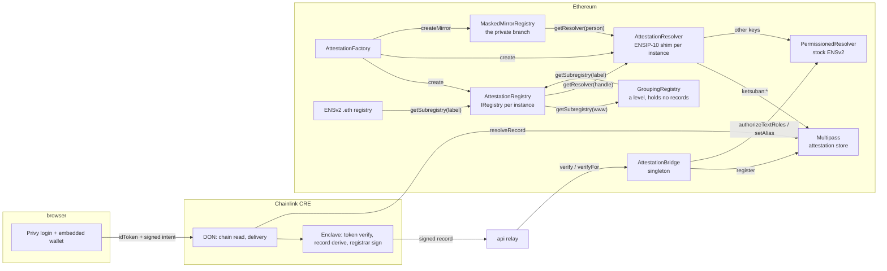

# Architecture

## Components

## An instance

One Multipass domain ↔ one ENS parent name. `AttestationFactory.create(domain, parent, parentLabel, parentName, inner)`
deploys the registry/resolver pair and records it; the bridge finds instances by `record.domainName`. Instances nest
through `AttestationRegistry.setSubregistry`.

A domain can have a second mount: `createMirror` deploys a `MaskedMirrorRegistry` for the private branch,
which answers a **person's** label and checks two records — a live name in the root domain, and a live
masked record in the platform domain. The open instance refuses masked records, so the two never answer
for each other. A `GroupingRegistry` is a level with no records of its own, shared by every account at
that DNS name.

Each resolver answers for names exactly one label under its own parent. The Universal Resolver falls back
to the nearest ancestor resolver, so without that check every instance would be a wildcard for everything
beneath it — `script/SetRootResolver.s.sol` repairs a live deployment, because every fallback ends at the
resolver the `.eth` registry names.

Platforms are mounted at their own DNS names under grouping levels — `x.com` at `com.x.www.<root>`, a
mail host under the at-sign level, both mirrored for masked records. See [the namespace](namespace.md).

Global, shared by every instance: platform domains (`x.com`, `t.me`, …), `humanity`, `org`, the stock
PermissionedResolver, the bridge, the factory, the CRE workflow, the API.

## Record lifecycle

1. **Intent.** Wallet signs `Intent{wallet, domain, nonce, exp, optIn, pubkey, handle, payload}` (EIP-712, domain
   `Ketsuban Intent/1`, `verifyingContract = Multipass`).
2. **Public leg (DON).** Signature recovers to `wallet`; `exp` fresh; `nonce` strictly greater than the on-chain nonce
   for `(wallet, domain)`; a renewal cannot rebind the wallet.
3. **Confidential leg (enclave).** ES256 identity token verified against the pinned Privy JWK; `wallet` ∈ linked
   wallets; the record is derived:
   - name domain: `name = handle`, `id = keccak256(DID)`, `payload = answer`
   - platform domain: `name = handle`, `id = platform id`, `payload = 0` — or, opted in,
     `name = handle ⊕ pad_name`, `id = id ⊕ pad_id`, `payload = keccak256(viewCode)`
   - `id` must equal the on-chain id when a record exists (opt-in is immutable)
   - registrar signs the Multipass `registerName` typed data (RFC-6979); the view code, if any, is ECIES-encrypted to
     `intent.pubkey` with a seed derived from the view-code key so replicas agree.
4. **Delivery.** `{ record, signature, viewCode? }` reaches the relay; the relay (or an org treasury) calls
   `AttestationBridge.verify` / `verifyFor`, which calls `Multipass.register` and grants the wallet
   `ROLE_SET_TEXT` on `avatar`, `description`, `url`, `email` for its new name.
5. **Resolution.** `<handle>.<parentName>` resolves through `AttestationResolver`; expiry is enforced at resolution,
   so a name goes dark at `validUntil` and returns on renewal.

## Humanity

The `humanity` domain is global and keyed by wallet, so the instance resolver hops into it from any name
the same wallet holds and answers `ketsuban:humanity[:until]`. The record's id is a World ID nullifier —
stable for one human, this app and one action — and its payload is the credential (`orb`,
`proof_of_human`). One human, one account is that id: Multipass refuses a second record carrying it, and
the relay refuses before spending anything, from a binding kept in `DATA_DIR`.

The proof is verified in the relay rather than the enclave: it carries no secret of the person's, and
World is the party that decides whether the mathematics holds. `apps/api/README.md` has the exchange.

## Trust boundaries

| Holder | Power |
|---|---|
| Registrar key (enclave / Node fallback) | signs records for its domains; never transacts |
| Multipass owner | `initializeDomain`, `changeRegistrar`, `deleteName`, fees |
| Factory / bridge / registry owner (operator) | creates instances, registers orgs, mounts subregistries |
| Bridge on PermissionedResolver | `ROLE_SET_TEXT_ADMIN`, `ROLE_SET_ALIAS` on root |
| User on PermissionedResolver | `ROLE_SET_TEXT` on four keys of their own name |
| Relayer / org treasury | pays for `verify` / `verifyFor` |

## Deploying an instance

1. `Multipass.initializeDomain(registrar, fee, renewalFee, domain, reward, discount)` + `activateDomain` (Multipass owner)
2. `AttestationFactory.create(...)` — `script/DeploySepolia.s.sol` does this for the first instance
3. Register `<parentLabel>.eth` on the ENSv2 ETHRegistrar, then `setSubregistry` / `setResolver` on the ETHRegistry
4. `PermissionedResolver.grantRootRoles(ROLE_SET_TEXT_ADMIN | ROLE_SET_ALIAS, bridge)` once;
   `authorizeDataRoles(ANY, "ketsuban:<key>", oracle, true)` per oracle key once
5. CRE: add the domain to `nameDomains`, secrets in Vault; API: `NAME_DOMAINS`, `DEPLOYMENT_FILE`
