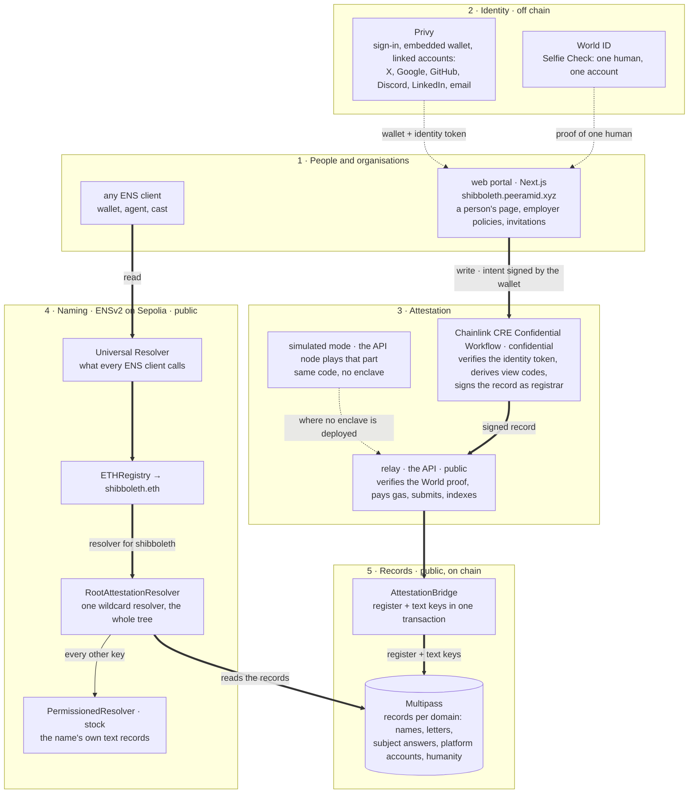
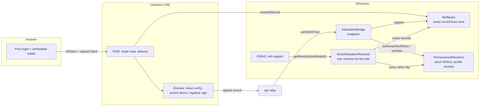
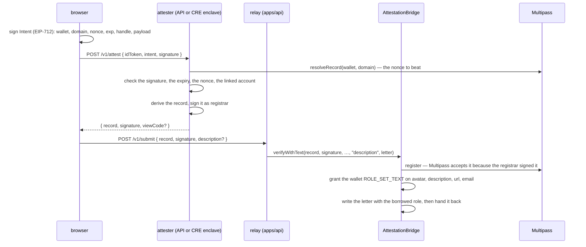
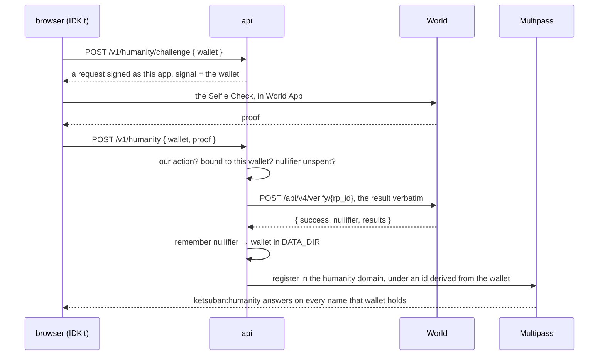

# Architecture

ShibbolETH writes vouches as Multipass records and names them with ENSv2. This is what runs where, how
a record gets written, and who can do what. [namespace.md](namespace.md) is what the names mean.

## The stack

The same picture the [README](../README.md) carries, and the one to read first: which layer each
external system is, and the two paths that cross every layer.

Read it as two sentences. **Write:** the portal has the person sign an intent with their Privy wallet,
the enclave verifies their identity token and signs the record as registrar, the relay pays the gas,
and `AttestationBridge` registers it in Multipass with its text keys in the same transaction.
**Read:** any ENS client asks the Universal Resolver, which reaches `RootAttestationResolver` through
`shibboleth.eth`, which answers from the Multipass records and forwards every other key to the stock
`PermissionedResolver`.

The component view below is the same system at one more turn of detail: where the DON ends and the
enclave begins, and which roles the bridge holds on the stock resolver.

## Components

The attester is the enclave where one is deployed, and this deployment's own node until then; the app
says which. Nothing is stored in ENS: the resolver reads Multipass on every call.

Global, shared by every subject: platform domains (`x.com`, `t.me`, …), `humanity`, `org`, the stock
PermissionedResolver, the bridge, the CRE workflow, the API.

## A subject

One Multipass domain is one level of the tree. A subject (`kju-is`), a platform (`x.com`), a candidate's
vouch domain (`~alice`) and the root (`shibboleth`) are all just domains; the resolver derives each
name from the domain, so adding one is `initializeDomain` + `activateDomain` and no deployment at all.

**Historical.** Before the root resolver, each mount was a deployed pair:
`AttestationFactory.create(domain, parent, parentLabel, parentName, inner)` made an
`AttestationRegistry` (ENSv2 `IRegistry`) and an `AttestationResolver` (ENSIP-10 shim), `createMirror`
made a `MaskedMirrorRegistry` for the private branch, and a `GroupingRegistry` held a level with no
records of its own. Those contracts are still deployed and still mounted for the flat platform names
(`x`, `telegram`, …) that predate the DNS namespace; everything else is unmounted and inert. The
migration is [root-wildcard-resolver.md](root-wildcard-resolver.md).

## The write path

A browser never writes. It signs an intent, the attester signs the record, and a relay — or the CRE
DON itself — pays to put it on chain.

Two things make the shape what it is. The relay holds no power over the record: Multipass accepts it
only because the registrar signed it, so a compromised relay can delay a write but not forge one. And
the letter is written in the same transaction (`verifyWithText`), because a wallet with no gas would
otherwise have a vouch on chain and nothing to read.

A record the CRE workflow writes skips the relay entirely: the nodes sign the payload, the
KeystoneForwarder calls `AttestationReporter.onReport`, and that hands it to the same bridge.
`POST /v1/cre/delivery` is the other path, where the DON posts the signed record to the relay instead.

## Record lifecycle

1. **Intent.** Wallet signs `Intent{wallet, domain, nonce, exp, optIn, pubkey, handle, payload}` (EIP-712,
   domain `Ketsuban Intent/1`, `verifyingContract = Multipass`).
2. **Public leg (DON).** Signature recovers to `wallet`; `exp` fresh; `nonce` strictly greater than the
   on-chain nonce for `(wallet, domain)`; a renewal cannot rebind the wallet.
3. **Confidential leg (enclave).** ES256 identity token verified against the pinned Privy JWK; `wallet` ∈
   linked wallets; the record is derived:
   - name domain: `name = handle`, `id = keccak256(DID)`, `payload = answer`
   - platform domain: `name = handle`, `id = platform id`, `payload = 0` — or, opted in,
     `name = handle ⊕ pad_name`, `id = id ⊕ pad_id`, `payload = keccak256(viewCode)`
   - `id` must equal the on-chain id when a record exists (opt-in is immutable)
   - registrar signs the Multipass `registerName` typed data (RFC-6979); the view code, if any, is
     ECIES-encrypted to `intent.pubkey` with a seed derived from the view-code key so replicas agree.
4. **Delivery.** `{ record, signature, viewCode? }` reaches the relay; the relay (or an org treasury, or
   the CRE reporter) calls the bridge, which calls `Multipass.register` and grants the wallet
   `ROLE_SET_TEXT` on `avatar`, `description`, `url`, `email` for its new name.
5. **Resolution.** `<handle>.<parentName>` resolves through `RootAttestationResolver`; expiry is enforced
   at resolution, so a name goes dark at `validUntil` and returns on renewal.

## The Selfie Check: one human, one account

A World ID proof says a real person is behind a wallet. The nullifier is what makes it _one_ person,
and it stays off chain.

The record holds the credential (`selfie`, `proof_of_human`) and nothing from World — no nullifier, no
proof, no merkle root. The id is derived from the wallet, because Multipass keeps an id for a record's
whole life and keeps its nonce even after deletion, while a World nullifier is per action and per
credential and is not something to publish either. So the nullifier does its one job off chain: a
second wallet presenting the same one is refused with 409. The binding lives in `DATA_DIR`, or every
redeploy would hand the same person another account.

The proof is verified in the relay rather than the enclave: it carries no secret of the person's, and
World is the party that decides whether the mathematics holds. `apps/api/README.md` has the exchange
field by field, and [selfie-check-feedback.md](selfie-check-feedback.md) what it cost to integrate.

## SybilScore: trust conserved from the seeds

The proved humans are the seeds; every live vouch is an edge. Two numbers are solved over that graph,
both after SybilRank (Cao et al., NSDI 2012) and the EigenTrust family, and both are signals for a
reader, not verdicts:

- **rank**: a short random walk from the seeds, trust split equally over connections at every step,
  cut off after O(log n) hops. Trust per connection, so collecting connections earns nothing.
- **SybilScore**, 0–100: proved humanity is a floor (20). A writer passes on at most one share (15%)
  of their own score in total, split across everyone they vouch for, weighted by how the council read
  each vouch where it has (supportive 1, critical 0, unread 1). Solved for O(log n) hops. Conservation
  is what makes SybilLimit's bound mean something: an attacker has to earn honest → sybil edges, and
  each one feeds the farm once, not once per account. A ring nobody proved sums to nothing however
  tightly it is wired; a hundred accounts behind one proved human hold together what one would.

`GET /v1/graph/:handle` answers both, with the neighbourhood and whether a person's vouchers vouch for
each other. `apps/api/src/graph.ts` holds the rules; the readings come from the council's kept
readings only, so the graph never asks it anything.

## Trust boundaries

| Holder                                       | Power                                                      |
| -------------------------------------------- | ---------------------------------------------------------- |
| Registrar key (enclave / Node fallback)      | signs records for its domains; never transacts             |
| Multipass owner                              | `initializeDomain`, `changeRegistrar`, `deleteName`, fees  |
| Factory / bridge / registry owner (operator) | provisions domains, registers orgs, sets the root resolver |
| Bridge on PermissionedResolver               | `ROLE_SET_TEXT_ADMIN`, `ROLE_SET_ALIAS` on root            |
| User on PermissionedResolver                 | `ROLE_SET_TEXT` on four keys of their own name             |
| Relayer / org treasury                       | pays for `verify` / `verifyFor`                            |

`deleteName` is the one power that contradicts what the product promises, so the owner should be a key
that signs nothing else. Where it is the relayer — a hot key transacting continuously — a single
compromise can remove vouches this deployment calls permanent, and `GET /v1/preflight` says so.

## Provisioning

1. `Multipass.initializeDomain(registrar, fee, renewalFee, domain, reward, discount)` + `activateDomain`
   (Multipass owner). `script/InitDomains.s.sol`, idempotent.
2. Nothing else for a platform, a subject or a candidate: the root resolver derives the name from the
   domain. A **new root** needs the label registered on the ENSv2 ETHRegistrar, a
   `RootAttestationResolver` deployed for it, `ETHRegistry.setResolver(label, resolver)`, and
   `AttestationBridge.setRootResolver(resolver)` so new names still get their four text-record grants.
3. `PermissionedResolver.grantRootRoles(ROLE_SET_TEXT_ADMIN | ROLE_SET_ALIAS, bridge)` once;
   `authorizeDataRoles(ANY, "ketsuban:<key>", oracle, true)` per oracle key once.
4. CRE: add the domain to `nameDomains`, secrets in Vault. API: `NAME_DOMAINS`, `DEPLOYMENT_FILE`.

Text an operator writes about a label nobody holds — a subject's description, an unclaimed public
figure — is `setAbout(domain, label, key, value)` on the root resolver. It does not follow a resolver
swap, so it is copied across before the old one is retired.

## Root-resolver mode, and the switch that selects it

The API switches on `ROOT_RESOLVER` (env, or `rootResolver` in the deployment file). Set — which is how
Sepolia runs — the tree is read from Multipass domains plus the name rule in
`packages/registrar/src/namespace.ts`, and no factory or registry is touched. Unset, the API enumerates
the factory for per-mount instances as it did before. Users' own text records, oracle data and aliases
are the stock PermissionedResolver's either way, forwarded by full name. The CRE handler is unaffected:
it signs Multipass records and never touches ENS.
