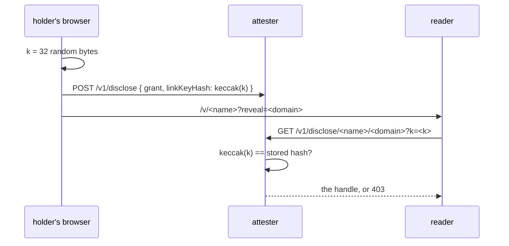

## The link secret

A grant addressed to one reader opens for that reader: the attester checks the wallet, or the name
they hold, against what the holder signed.

A grant made for *whoever holds the link* is addressed to the zero address, so it binds nobody — the
link is the whole permission. It used to be
`/v/<their public name>?reveal=<the account>`, both halves of which anybody can guess, so an account
shared this way was not shared, it was published, while the page promised "anyone holding this link".

Such a grant now carries a secret:



- The secret is minted in the browser and never sent to the attester — only its hash is.
- It travels in the URL **fragment**, which a browser does not send to a server, so it reaches no
  access log and no referrer header.
- `GET /v1/disclosures/:name` is the holder's own list of who can read what. It returns the grant id
  and never the hash, so reading that list does not hand out the permissions it describes.
- The hash is not part of what the holder signed. It is therefore written once: re-posting the same
  grant cannot swap in a secret somebody else chose.
- Grants made before this stop opening and must be shared again. That is the point: they had no
  secret, so anybody could already read them.

### A grant that rides with an invitation

A candidate inviting somebody to refer them can open their private accounts to that writer, so the
writer is not asked to vouch for someone half visible. That grant is addressed to nobody, because the
invitation is already the permission — and its secret is therefore the invitation's own code:

```
linkKey = keccak256("ketsuban:invite:" + code)
```

Both ends derive it, so nothing extra is sent and the writer carries one link rather than two. The
invitation's code is 128 bits, which is what makes this worth deriving from.

The writer sees what was opened on the referral page itself: the list of a name's grants is public —
it names domains and expiry, never a handle — so the page can tell which accounts to ask about, and
opening one still takes the invitation.
