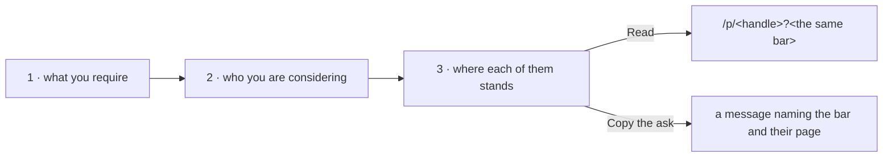

# Checking a list of people

`/employers` is the same reading a person's page gives, asked of everybody under consideration at
once. Nothing on it is new machinery: the bar, the link that carries it, and the reading of somebody
against it all existed one candidate at a time.

## The bar

A preset the platform ships, or one of the reader's own. Building one opens the same form a person's
page uses; saving it puts it beside the presets here and there.

## The list

A handle at a time, found the way anybody is found here. It lives in the reader's browser, with their
policies, and is never sent anywhere: who somebody is considering says as much about them as about the
candidates.

## The standing

Each row is `assessProfile` against the bar — the same function the candidate's own page renders — so
a row and the page it links to cannot disagree. A row that falls short names the checks it failed
rather than saying "incomplete", because the employer's next step is asking for that thing.

## What it does not do

It sends nothing. "Copy the ask" produces a message the employer sends themselves, carrying the bar in
the link. An invitation in this codebase is a candidate asking somebody to refer them — signed by the
wallet holding their name — and is a different object from an employer asking a candidate to present
themselves.
