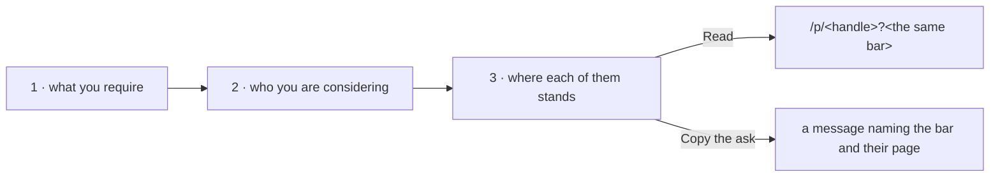

# Checking a list of people

`/employers` is the same reading a person's page gives, asked of everybody under consideration at
once. Nothing on it is new machinery: the bar, the link that carries it, and the reading of somebody
against it all existed one candidate at a time.

## The bar

A preset the platform ships, or one of the reader's own. Building one opens the same form a person's
page uses; saving it puts it beside the presets here and there.

## The list

A handle at a time, found the way anybody is found here. It lives in the reader's browser, with their
policies, and is never sent anywhere: who somebody is considering says as much about them as about the
candidates.

## The standing

Each row is `assessProfile` against the bar — the same function the candidate's own page renders — so
a row and the page it links to cannot disagree. A row that falls short names the checks it failed
rather than saying "incomplete", because the employer's next step is asking for that thing.

## What it does not do

It sends nothing. "Copy the ask" produces a message the employer sends themselves, carrying the bar in
the link. An invitation in this codebase is a candidate asking somebody to refer them — signed by the
wallet holding their name — and is a different object from an employer asking a candidate to present
themselves.

## Inviting somebody who has no page yet

An employer usually knows a candidate by an account — `@lamtrinh259` on github.com — and nobody may
hold a name for it here. The search says so, and on `/employers` the answer is an invitation rather
than a dead end:

> peersky.shibboleth.eth is inviting you to pass their Backend engineer risk assessment policy, please
> follow this link and begin with connecting your github.com account (@lamtrinh259):
> https://shibboleth.peeramid.xyz/me?invite=0123456789abcdef0123456789abcdef

It is the same invitation resource the candidate side already uses — one store, one code shape, one
`?invite=<code>` link shape — with a second kind. `POST /v1/invite` with `kind: "policy"` takes
`{ inviter, platform, account, policy, exp, signature }`: the employer's handle, the platform and
account they know the person by, the bar as the query string a reference page reads a policy from,
and an EIP-712 signature (`Ketsuban Policy Invite`) from the wallet holding the inviter's name. The
attester refuses anything else, so "X is inviting you" is X's own claim. Signing needs the employer
signed in and holding a name; the page says so when they are not.

The link lands on `/me?invite=<code>`. `GET /v1/invite/:code` answers with the invitation and how far
the person has come — `invited` (not here yet), `linked` (the account is attested, no name yet) or
`claimed` (with `candidate`) — so the page says who is asking, what they require and which account to
begin with, then, once there is a page, reads it against the bar.

`GET /v1/invites/<inviter>` carries the same list as `asked`, which is what "Whom you invited" on
`/employers` shows: every invitation as a pending check until the person has a page, then a link to
read them against the bar. An expired invitation that nobody used stays listed as "never came".

## Somebody already on the list

The same invitation, named by their handle: `platform` is the root name domain and `account` the handle,
so `GET /v1/invite/:code` reads as `claimed` at once and the person is told to begin with their page.
The prose "ask" that carried the bar in a paragraph is gone; every message an employer sends is the
invitation above, and it is listed under "Whom you invited" like any other. The policy itself is found
by typing its name — presets and the reader's own — as on a person's page.

## A bar on how the references read

A policy may cap how many references read as critical (`maxCritical`, in the builder as "at most this
many reading as critical"). The count comes from the same council reading a person's page sums up, so
the check is a reading of text, not a judgement of the person — and where no council is configured the
check says so and is not met, rather than passing by default. Each row on `/employers` also says how
many of a candidate's references read as supportive and as critical.
