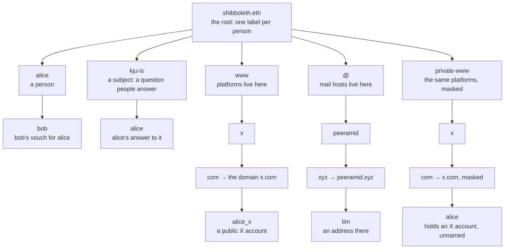
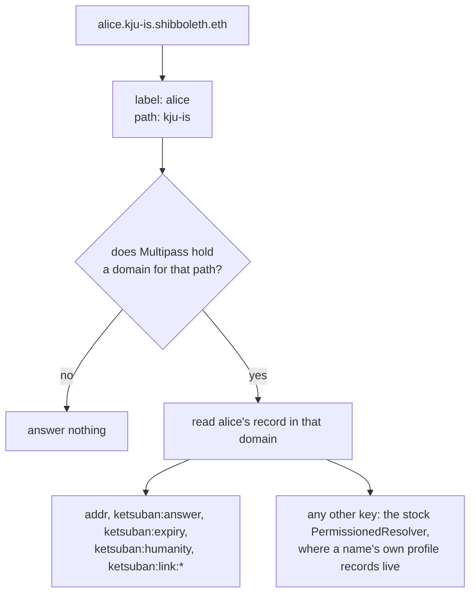

# The namespace

A person's name is the root: `alice.shibboleth.eth`. Everything else hangs off grouping levels reserved
beside it, so a person can be called anything without colliding with a platform.

## Why it is shaped this way

A platform is a DNS name. Mounting an account at `alice.x.shibboleth.eth` puts the platform `x` on the
same level as a person called `x`, and says nothing about which service is meant: the DNS name `x.com`
says both. An email address is not a handle at all, so mail hosts are grouped apart under `@`.

A DNS name mounts **first label first**. `x.com` walks `www` → `x` → `com`, which reads back as
`com.x.www.shibboleth.eth`. A service that hands out subdomains keeps them apart that way:
`tenant.acme.com` is its own chain rather than a level inside the accounts of `acme.com`.



| Record | Name |
| --- | --- |
| A person | `alice.shibboleth.eth` |
| A vouch for that person | `bob.alice.shibboleth.eth` |
| An answer to a subject | `alice.kju-is.shibboleth.eth` |
| A public X account | `alice_x.com.x.www.shibboleth.eth` |
| A public address at peeramid.xyz | `tim.xyz.peeramid.@.shibboleth.eth` |
| A masked X account | `alice.com.x.private-www.shibboleth.eth` |

## The private branch

An account someone keeps behind a view code has a masked name: a one-time pad over the handle, which is
unreadable and cannot be a label anyone would ask for. So the mirror names the **person** instead.
`alice.com.x.private-www.shibboleth.eth` resolves to Alice's wallet and says the holder of
`alice.shibboleth.eth` has an account on X. Which account stays behind the view code.

Both halves are enforced: the label must be a live name in the root domain, and that wallet must hold a
live masked record in the platform domain. The open branch under `www` refuses to answer for a masked
record at all, so the two never leak into each other. The root resolver does this today; the per-mount
tree did it with a `MaskedMirrorRegistry` per platform.

The mirror reads the **root** instance, so the private name is an exact alias of the person's own name:
`alice.com.discord.private-www.shibboleth.eth` answers with the same address, the same answer and the same
profile records as `alice.shibboleth.eth`. It exists only while both records are live, which is what makes
it a statement — this person is on Discord — rather than a redirect.

Nothing about the account itself is published. The stored name is `maskName(handle, viewCode)`, a
one-time pad over the handle exactly as the platform writes it, discriminator and all: `slayer69` and
`peersky#0` are equally invisible, and a view code is the only thing that opens either.

## One resolver answers all of it

There is no registry or resolver per platform, subject or candidate any more. One
`RootAttestationResolver` is set on `shibboleth.eth` and answers every name beneath it, because
Multipass already **is** the tree: a name minus the root splits into `<label>.<path>`, and the path
names a Multipass domain. A path no domain matches answers nothing, which is what stops the resolver
being a wildcard for anything anyone types.



The path rule, which is the namespace written as code
(`packages/contracts/src/RootAttestationResolver.sol`, `locate`):

| Path | Multipass domain | Example |
|---|---|---|
| none | the root name domain `shibboleth` | `alice.shibboleth.eth` |
| `<subject>` | that name domain, if Multipass holds it | `alice.kju-is.shibboleth.eth` |
| `<candidate>` | the vouch domain `~candidate` | `bob.alice.shibboleth.eth` |
| `<dns reversed>.www` / `.@` | the platform or mail host | `alice_x.com.x.www.shibboleth.eth` → `x.com` |
| `<dns reversed>.private-www` / `.private@` | the same, masked | `alice.com.x.private-www.shibboleth.eth` |

Expiry is enforced at resolution, so a name goes dark at `validUntil` and comes back on renewal. The
humanity answer is keyed by wallet, so it is reachable from any name that wallet holds. Adding a
platform or a candidate deploys nothing: it initialises a Multipass domain.

Why it matters that the resolver knows the tree: the Universal Resolver falls back to the nearest
ancestor resolver, so a root resolver that answered by label alone would resolve `alice.<anything>.<root>`
as Alice, and a person would appear to hold accounts on platforms they never attested. How the tree got
here from one registry and resolver per mount is [root-wildcard-resolver.md](root-wildcard-resolver.md).

## Reserved labels

`www`, `@`, `private-www` and `private@` are mounted at the root, so nobody can be called them. The flat
platform names (`x`, `google`, …) stay reserved too, for deployments that predate this namespace and
mount platforms directly under the root.

## Deploying it

Adding a platform to a deployment in root-resolver mode is one pair of Multipass owner calls —
`initializeDomain` then `activateDomain` — and nothing else: the resolver derives the name from the
domain. `script/InitDomains.s.sol` does that and is idempotent.

**Historical, for the per-mount tree.** `script/AddNamespace.s.sol` built the whole thing from one
operator key and was re-runnable: a level or instance that already existed was reused, so adding a
platform later disturbed nothing.

```bash
DEPLOYMENT_FILE=deployments/sepolia.json REGISTRAR=0x… PRIVATE_KEY=$OPERATOR_KEY \
WWW_NAMES=x.com,github.com,google.com,discord.com,linkedin.com,t.me \
AT_NAMES=peeramid.xyz \
forge script script/AddNamespace.s.sol --rpc-url $SEPOLIA_RPC --broadcast
```

Each name in the list becomes a Multipass domain, an instance in the open branch, and a mirror in the
private one. Either way the API derives a record's ENS name from what the chain holds rather than from
a list kept here, so the two cannot drift apart.

## A domain nobody deployed yet

Nobody can enumerate every mail host in advance, so the relay builds one on demand. When an account is
attested into a DNS domain this deployment does not hold, `/v1/attest` verifies the request first — the
identity token, the wallet link, and that the address really was issued by that domain — and only then
provisions the domain, before returning the signature. The person sees an ordinary attestation.

Nothing is provisioned for a request the attester refuses, and a provisioning that fails returns 503
rather than a signature for a domain that does not exist. In root-resolver mode that is a Multipass
domain and no more; in the per-mount tree it was grouping levels, an instance and a mirror, and needed
`NAMESPACE_FACTORY` set to a factory new enough to build the mirror.

## The other direction

ENS has its own reverse namespace, and the Universal Resolver answers it with
`reverse(address, coinType)` — the name a wallet's holder set as their primary, checked against forward
resolution. Nothing here writes that: it belongs to the holder, and setting it needs the reverse registrar
of the ENSv2 deployment, which this repo does not yet name.

Meanwhile the resolver answers `name()` for `<hex>.addr.reverse` from the Multipass record, so
`GET /v1/reverse/<address>` returns both: the names the records give, and `primary` — what ENS itself says,
or `null` when the holder has set nothing. The profile says which is which, because a wallet showing a name
beside an address is reading the second one.

## Reading a name back

`GET /v1/explain/:name` answers what a name would claim here, from the domains on chain rather than from
its shape:
`kind` is `person`, `account`, `private`, `reference` or `unknown`. The last one matters — a caller needs
to tell a name nobody happens to hold from one this deployment could never answer for.

```bash
curl -s $API/v1/explain/alice.com.x.private-www.shibboleth.eth | jq '{kind, domain, says}'
```

`/v1/explain` is the same function the app reads, so the sentence a person is shown and the one an
agent gets are the same sentence.

## What a client attests into

The web app asks the deployment, not a table: a connected X account goes to `x.com` where that is
mounted and to `x` where it is not, and an email goes to the domain that issued it. A mail host nobody
deployed has no namespace, and the app says so rather than letting someone sign into a revert.

## Saying what a subject instance is for

A question is only worth answering if a reader knows what the answer is for. `kju-is` asks what
someone thinks of Kim Jong Un, and the point is not the opinion: a verifier uses it to test whether a
subject is affiliated with North Korean operators, who will not answer it freely.

That belongs on the instance's own name, so any ENS client reads the purpose beside the answers:

```bash
PERMISSIONED_RESOLVER=0x4E2d9783cEFF2ed72CD77C14206b29fe246b24F7 \
NAME=kju-is.shibboleth.eth KEY=description \
VALUE="Answering this question lets a verifier test whether a subject is affiliated with North Korean operators, who will not answer it freely." \
PRIVATE_KEY=$OPERATOR_KEY \
forge script script/SetInstanceText.s.sol --rpc-url $RPC --broadcast
```

The script grants itself the text role for that key before writing. A root operator can set the key
without one today; the grant is what keeps the write working when that role moves.

## A page for someone who has claimed nothing

Anyone can be referred before they hold a name, so a page can exist for a person who has never heard
of this deployment. Such a page is only worth reading if it says who it is about, and that belongs on
the name rather than in the app — `/v/<instance>.<root>` reads `description`, `url` and `avatar`
straight off the instance name, so any ENS client shows the same thing.

`kju-is` is the worked example, written by whoever deployed the page:

```bash
PERMISSIONED_RESOLVER=0x… ROOT=shibboleth.eth PRIVATE_KEY=$OPERATOR_KEY RPC=… \
  packages/contracts/script/kju-is.sh
```

The description states attribution as attribution — the Lazarus Group is attributed to the DPRK by the
United States and allied governments — rather than asserting it as this deployment's own finding. What
the page then shows is the answers people published under it, each at its own name, and each one a
thing a candidate can say freely and a DPRK-linked operator cannot.
