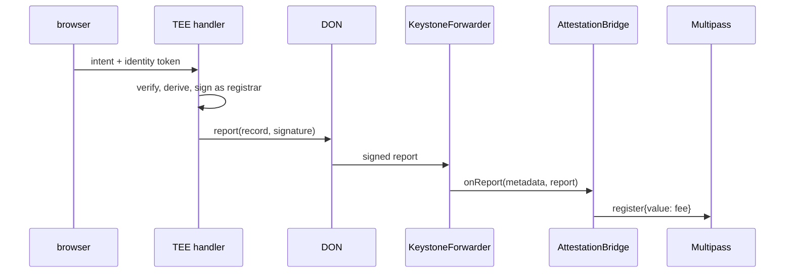

# CRE workflow: `attest`

Confidential workflow that turns a wallet-signed intent plus a Privy identity token into a
registrar-signed Multipass record. The enclave is the registrar: the signing key and the view-code
key exist only inside it.

```
HTTP trigger { idToken, intent, signature }
  └─ handlerInTee
       ├─ usingTheDons(): Multipass.resolveRecord(wallet, domain)      public
       ├─ verifyPublicLeg: intent signature, expiry, nonce, wallet     public
       ├─ getSecret(REGISTRAR_KEY), getSecret(VIEWCODE_KEY)            enclave
       ├─ attestConfidential: verify ES256 token, derive record, sign  enclave
       ├─ report + writeReport → KeystoneForwarder → AttestationBridge  DON
       └─ optional POST to deliveryUrl via the DON (identical consensus)
```

## Config (`attest/config.*.json`)

| Field | Meaning |
|---|---|
| `chainSelectorName`, `chainId`, `multipass`, `eip712` | Multipass deployment the enclave signs for |
| `privy.appId`, `privy.verificationKey` | identity-token audience and pinned P-256 JWK |
| `nameDomains` | domains whose records are `{ handle, keccak(DID), answer }` — the instance subjects |
| `secretIds` | Vault / `.env` secret IDs for the registrar and view-code keys |
| `authorizedKeys` | EVM addresses allowed to fire the trigger (empty only in simulation) |
| `bridge` | `AttestationBridge` the DON writes the record to; unset returns the signed record only |
| `reportGasLimit` | gas for the forwarder's `onReport` call |
| `deliveryUrl` | relay endpoint (`apps/api` `/v1/cre/delivery`); empty returns the result only |

## Who writes the record

`bridge` is unset in the configs here: the bridge that accepts reports is the one deployed by
`packages/contracts/script/UpgradeBridge.s.sol` with a `CRE_FORWARDER` constructor argument. Deploy
it, put its address in `bridge`, and the write path below is live. Until then the workflow returns the
signed record and `apps/api` writes it with the relayer key.

With `bridge` set, the nodes sign the payload (`runtime.report`) and the KeystoneForwarder calls
`AttestationBridge.onReport`, which registers the record and pays the Multipass fee from its own
balance. No key of ours is in that path: the enclave signs as registrar, the DON delivers, and the
bridge only accepts reports from the forwarder for its chain.



`deliveryUrl` remains for the relay path: `apps/api` provisions a candidate's vouch instance when
their root name lands. Both can be enabled; the bridge write is what removes the relayer key from
the attestation path.

## Run

```bash
cp .env.example .env                                   # simulation secrets
cd attest && pnpm install && bun test                  # unit tests with a fake TEE runtime
bun run scripts/make-fixture.ts [name]                 # fixtures/request.json + config.local.json
cd .. && cre workflow simulate attest --target local-settings --non-interactive --trigger-index 0 \
  --http-payload ./attest/fixtures/request.json
```

The simulator prints the signed record; the relay submits it. Deployment needs Confidential Workflows
beta access; simulation does not.
