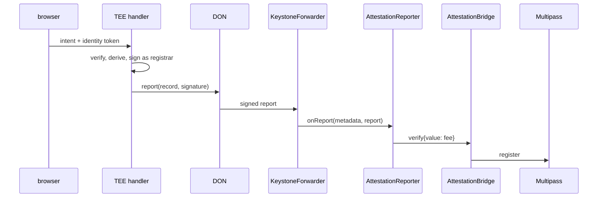

# CRE workflow: `attest`

Confidential workflow that turns a wallet-signed intent plus a Privy identity token into a
registrar-signed Multipass record. The enclave is the registrar: the signing key and the view-code
key exist only inside it.

```
HTTP trigger { idToken, intent, signature }
  └─ handlerInTee
       ├─ usingTheDons(): Multipass.resolveRecord(wallet, domain)      public
       ├─ verifyPublicLeg: intent signature, expiry, nonce, wallet     public
       ├─ getSecret(REGISTRAR_KEY), getSecret(VIEWCODE_KEY)            enclave
       ├─ attestConfidential: verify ES256 token, derive record, sign  enclave
       ├─ report + writeReport → KeystoneForwarder → AttestationReporter DON
       └─ optional POST to deliveryUrl via the DON (identical consensus)
```

## Config (`attest/config.*.json`)

| Field | Meaning |
|---|---|
| `chainSelectorName`, `chainId`, `multipass`, `eip712` | Multipass deployment the enclave signs for |
| `privy.appId`, `privy.verificationKey` | identity-token audience and pinned P-256 JWK |
| `nameDomains` | domains whose records are `{ handle, keccak(DID), answer }` — the instance subjects |
| `secretIds` | Vault / `.env` secret IDs for the registrar and view-code keys |
| `authorizedKeys` | EVM addresses allowed to fire the trigger (empty only in simulation) |
| `reporter` | `AttestationReporter` the DON writes the record to; unset returns the signed record only |
| `reportGasLimit` | gas for the forwarder's `onReport` call |
| `deliveryUrl` | relay endpoint (`apps/api` `/v1/cre/delivery`); empty returns the result only |
| `provisionUrl` | endpoint the log trigger calls to provision a candidate's vouch instance; empty disables it |

## Three handlers

| Trigger | Handler | What it does |
|---|---|---|
| HTTP, in a Nitro enclave | `onAttest` | verifies the identity token and the wallet intent, signs the record as registrar, optionally writes it through the DON |
| HTTP, in a Nitro enclave | `onDisclose` | answers which account a masked record belongs to, for whoever the candidate allowed |
| EVM log on `Registered` in the root name domain | `onRegistered` | asks the relay to provision that candidate's `~<handle>` vouch instance |

`onDisclose` exists because the registrar key is the only key that can open a candidate's permission,
and it lives in the enclave. A masked record publishes a commitment; the permission carries the view
code encrypted to that key; the enclave checks the candidate signed it, that it has not expired, that
it binds to this ciphertext and that the reader is the one it names, then answers with the handle. The
handle is the only thing that leaves, and nothing is written anywhere.

The log trigger exists because a candidate's vouch instance is a consequence of their name existing.
Driving it from the chain means it happens whether or not the record came through our own relay, and
the endpoint it calls needs no secret: it refuses any handle that does not already hold a live record.

## Who writes the record

Set `reporter` to the `AttestationReporter` deployed by
`packages/contracts/script/DeployReporter.s.sol` and the write path below is live. Unset, the workflow
returns the signed record and `apps/api` writes it with the relayer key.

With `bridge` set, the nodes sign the payload (`runtime.report`) and the KeystoneForwarder calls
`AttestationReporter.onReport`, which hands the record to the bridge and pays the Multipass fee from
its own balance. No key of ours is in that path: the enclave signs as registrar, the DON delivers, and
the reporter only accepts reports from the forwarder for its chain. The reporter holds no privileges,
so an existing bridge gains this path without any migration.



`deliveryUrl` remains for the relay path: `apps/api` provisions a candidate's vouch instance when
their root name lands. Both can be enabled; the bridge write is what removes the relayer key from
the attestation path.

## Run

```bash
cp .env.example .env                                   # simulation secrets
cd attest && pnpm install && bun test                  # unit tests with a fake TEE runtime
bun run scripts/make-fixture.ts [name]                 # fixtures/request.json + config.local.json
cd .. && cre workflow simulate attest --target local-settings --non-interactive --trigger-index 0 \
  --http-payload ./attest/fixtures/request.json
```

The simulator prints the signed record; the relay submits it. Deployment needs Confidential Workflows
beta access; simulation does not.

## Deploying it to a live deployment

The order matters, and one step fails silently if it is wrong.

**1. Ask for deployment access.** `cre account access`. A browser step, and the only one nobody else
can do for you. The simulator prints this prompt itself once a run succeeds.

**2. Give the enclave the registrar key Multipass already accepts.** This is the step that fails
quietly. Multipass verifies the *registrar's signature* on a record, not the address that submitted
it, so the enclave must sign with the key the domains were initialised with. Read it off the chain
rather than assuming:

```bash
curl -s $API/v1/preflight | jq '.registrar.signsAs, [.multipass.domains[].registrar] | unique'
```

Both must be the same single address, and `SECRET_REGISTRAR_KEY` uploaded to CRE must derive to it.
Sign with any other key and every attestation reverts at `register`, after the person has already
signed — which looks like a broken product rather than a misconfigured secret.

`SECRET_VIEWCODE_KEY` must equal the API's for the same reason in reverse: view codes already handed
out were derived from it, and a new one leaves every masked account unreadable to the people who were
given permission to read it.

**3. Deploy.** `cre workflow deploy attest --target production-settings`. `config.production.json`
already carries this deployment's Multipass, Privy app and name domains; `reporter` is the
`AttestationReporter`, and `deliveryUrl` is deliberately empty, because the DON write is the path that
removes our relayer key from attestation altogether.

**4. Point the browser at the trigger.** `NEXT_PUBLIC_ATTEST_URL=<the trigger URL>`, as a **build
arg** — it is inlined at `next build`, so a runtime variable never reaches the bundle.

**5. Check the claim turned on.** The web decides whether to promise an enclave by comparing that URL's
origin against the API's (`isConfidential`), so the sign flow and the landing page begin saying the
identity token is read inside the enclave. If they still say the attester signs on its own node, step
4 did not take effect and the claim is correctly absent.
